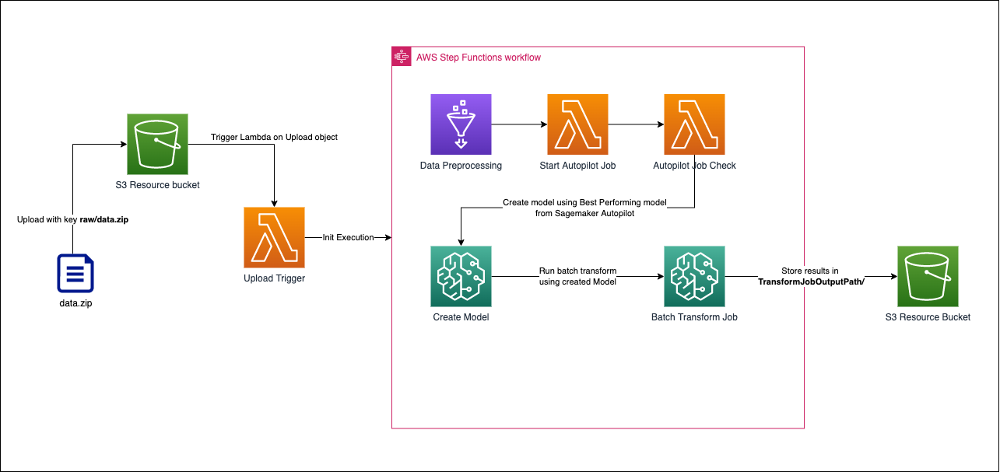
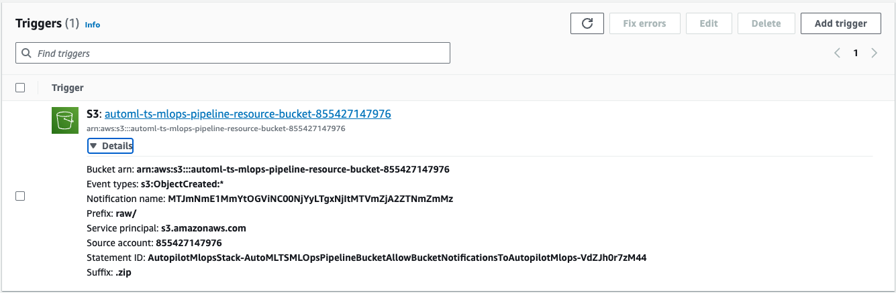
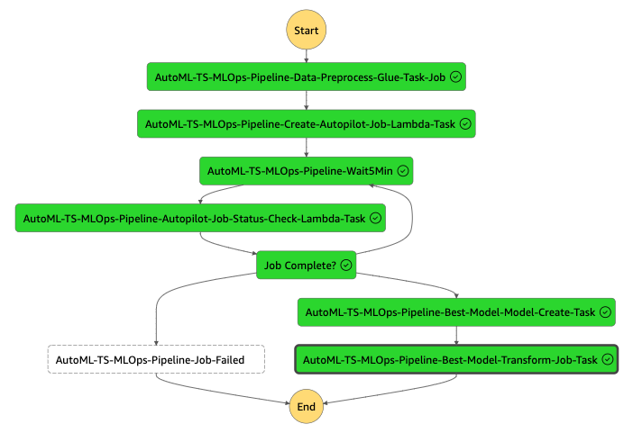

# Serverless Autopilot MLOps Pipeline for Time Series using CDK

> This is a CDK implementation demonstrates how to build custom model for Time Series Forecasting workflow using 

## Prerequisites

AWS CDK v2 is required to deploy this application.
See [Installation Guide](https://docs.aws.amazon.com/cdk/latest/guide/work-with-cdk-typescript.html) to install AWS CDK in TypeScript.  

Once complete with the previous step, run below command on the root of this project to deploy the pipeline.

```bash
cdk deploy AutopilotMlopsStack
```

If successfully deployed, we are ready to launch 🚀🚀🚀


## Solutions Architecture



This package contains a CDK implementation of a MLOps Pipeline for Amazon Autopilot for Time Series data. The pipeline automatically performs Amazon Autopilot operations and relevant operations. Basically, each of the operations are either implemente with AWS Lambda, AWS Glue, or direct call of SageMaker from Step Functions, and the entire operations are orchestrated by AWS Step Functions.

The pipeline consist of the following steps:

### Trigger the MLOps Pipeline
Implemented in Lambda Function which is triggered by S3 Bucket when a new __.zip__ file is uploaded into __/raw__ in a S3 Bucket created by CDK. Lambda Function triggers the Step Function pipeline.

### Data Preprocessing
Implemented in Glue Python Job. Performs data operations defined in python scripts. The current code does nothing but printing out dataset files, but you can add your own preprocessing logics using pandas, NumPy, sklearn, etc.

### Autopilot Training Creation
Implemented in Lambda Function. Creates Amazon SageMaker Autopilot Training job for Time Series data using a newest version of SageMaker API [CreateAutoMLJobV2](https://docs.aws.amazon.com/sagemaker/latest/APIReference/API_CreateAutoMLJobV2.html), as there no direct intergation from Step Functions for this API.

### Autopilot Job Check
Implemented in Lambda Function with Step Functions loop process. Step Functions does a loop and each 5 minutes runs Lambda Function which checks the status of created Amazon SageMaker Autopilot Training job using a newest version of SageMaker API [DescribeAutoMLJobV2](https://docs.aws.amazon.com/sagemaker/latest/APIReference/API_DescribeAutoMLJobV2.html), as there no direct intergation from Step Functions for this API.

### Create Model
Implemented as direct call of SageMaker APIs from Step Functions task to create an AI Model using the best performing trained model from SageMaker Autopilot Training.

### Batch Transform Job
Implemented as direct call of SageMaker APIs from Step Functions task to create a Batch Transform Job using the model defined in "Create Model" step. The results are going to be stored in the same Resource Bucket created by CDK, but in the folder __TransformJobOutputPath/__.

## How to Run

This section explains how to trigger the pipeline to run Amazon Autopilot pipeline from end to end. Follow the instructions in order.

### Prepare Dataset

Prepare your own dataset in csv files formatted for Amazon Autopilot.
See this [link](https://docs.aws.amazon.com/sagemaker/latest/dg/timeseries-forecasting-data-format.html) for details aboout Amazon Autopilot for Time Series dataset format.

For those who want to execute the pipeline before preparing your own dataset, sample dataset is included in this project. Please see __sample-data/data.zip__.

> In __sample-data/data.zip__, `TTS.csv` contains monthly sales history of instruments in Amazon Autopilot Target Time Series format. 

When you prepare your own dataset, be sure to match the directory structure of the dataset file __data.zip__. The directory structure should look like below.

```bash
data.zip
│────TTS.csv # mandatory
```

> Please note that the names of csv files should be `TTS.csv`.

> Be aware, that if you are doing simple .zip of the folder on MacOS via Finder app, then it adds additional files into the .zip, so create this .zip file and then remove these files by commands in terminal like `zip -d data.zip __MACOSX .DS_Store`.


### Upload to Launch

Finally, you are ready to launch the pipeline. After you deploy this pipeline,
you will see an S3 bucket named `automl-ts-mlops-pipeline-resource-bucket-{YOUR-12DIGIT-AWS-ACCOUNT-ID}`. All you have to do now is to upload files prepared from the previous steps. 

You have to upload your on data.zip file to __raw/__ directory in the same bucket.

```bash
aws s3 cp data.zip s3://automl-ts-mlops-pipeline-resource-bucket-{YOUR-12DIGIT-AWS-ACCOUNT-ID}/raw
```

> You should upload `data.zip` as the final step because `raw/*.zip` is registered as the upload trigger key of the pipeline. Therefore the pipeline will be triggered immediately after `raw/data.zip` is uploaded.



Navigate to the StepFunctions console to monitor the excecution. You will see the progress like below while execution.



When the steps are completed, the __Resource Bucket__ will have the following structure:

```bash
raw/                        # Where you uploaded the raw dataset
input/                      # Where preprocessed csv file is stored
autopilot-output/           # Where experiment models artifacts created by SageMaker Autopilot are stored
output-forecasted-data/     # Where final csv file with predictions using AIML model is stored
```


## Project Structure
This project follows typical AWS CDK project structure. The below directories are important from the user perspective.

```bash
bin/                    # Entrypoint of the entire project
lib/                    # CDK Constructs and Stacks are defined
lambda/                 # Python scripts for Lambda Functions
glue/                   # Python scripts for Glue Jobs
```


## 👀 Got Problems?

Please open an issue to let the maintainer know. Or PR would be also appreciated.
The maintainer will reach out!

## Security

See [CONTRIBUTING](CONTRIBUTING.md#security-issue-notifications) for more information.

## License

This library is licensed under the MIT-0 License. See the LICENSE file.